# Zenodo Deposit Workflow Diagram

This diagram outlines the workflow followed for depositing a record to Zenodo once it has been selected.

If DOI versioning is enabled in OJS, the workflow remains the same, but the user can deposit each major version of a record.

The workflow does not include cases where errors are encountered during the process.

```mermaid
flowchart TD
    Start([Start Deposit of Selected Records]) --> CheckAPIKey{API Key<br/>Configured?}

    CheckAPIKey -->|No| ErrorNoKey[Return Error:<br/>No API Key]
    CheckAPIKey -->|Yes| CheckDOI{Check DOI<br/>Setting}

    CheckDOI -->|Mint Zenodo DOI disabled<br/>& No DOI| ErrorNoDOI[Return Error:<br/>Record Missing DOI]
    CheckDOI -->|Has DOI or<br/>Zenodo DOI enabled| CheckExisting{Existing<br/>Zenodo ID stored?}

    CheckExisting -->|Yes| CheckPublished{Is Record<br/>published in Zenodo?}
    CheckExisting -->|No| CreateDraft[Create New Draft]

    CheckPublished -->|No - is Draft| DeleteDraft[Delete Existing Draft]
    CheckPublished -->|Yes| CreateFromPublished[Create Draft from<br/>Published Record]

    DeleteDraft --> CreateDraft
    CreateFromPublished --> UpdateDraft[Update Draft Metadata]

    CreateDraft --> SetZenodoID[Store Zenodo ID<br/>for Object & Siblings]
    UpdateDraft --> SetZenodoID

    SetZenodoID --> CheckPublishedForFiles{Is Record<br/>Published?}

    CheckPublishedForFiles -->|Yes| SkipFiles[Skip File Upload<br/>Cannot update files<br/>on published records]
    CheckPublishedForFiles -->|No| DepositFiles[Upload Files from Galleys]

    DepositFiles --> CheckAutoPublish{Auto Publish<br/>Setting Enabled or<br/>Previously Published?}
    SkipFiles --> CheckAutoPublish

    CheckAutoPublish -->|Yes| PublishDraft[Publish Draft]
    CheckAutoPublish -->|No| SkipPublish[Keep as Draft]

    PublishDraft --> SetRegistered[Set Status:<br/>REGISTERED]
    SkipPublish --> SetRegistered

    SetRegistered --> CheckCommunity{Community ID<br/>Configured?}

    CheckCommunity -->|No| Success[Return Success]
    CheckCommunity -->|Yes| CheckIfPublished{Is Record<br/>Published?}

    CheckIfPublished -->|Yes| SubmitPublished[Submit Published<br/>Record to Community]
    CheckIfPublished -->|No| CreateReview[Create Review Request]

    CreateReview --> SubmitReview[Submit Review Request]

    SubmitPublished --> CheckAutoPublishCommunity{Auto Publish Community<br/>Setting Enabled?}
    SubmitReview --> CheckAutoPublishCommunity

    CheckAutoPublishCommunity -->|Yes| AcceptReview[Accept Review<br/>Publishes record<br />if not already published]
    CheckAutoPublishCommunity -->|No| Success

    AcceptReview --> Success

    ErrorNoKey --> End([End])
    ErrorNoDOI --> End
    Success --> End

    style Start fill:#d4edda
    style Success fill:#d4edda
    style End fill:#d4edda
    style ErrorNoKey fill:#f8d7da
    style ErrorNoDOI fill:#f8d7da
    style PublishDraft fill:#fff3cd
    style AcceptReview fill:#fff3cd
```

